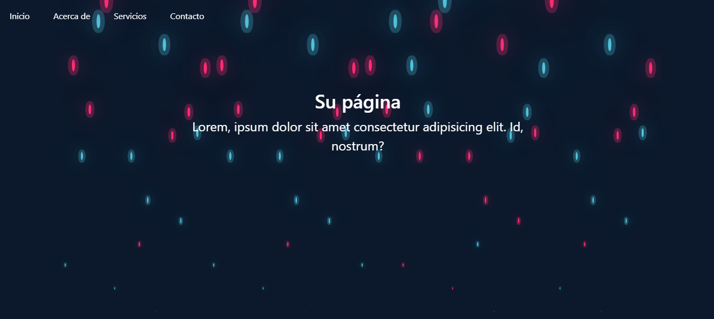

# Página Burbujas

Este es un proyecto simple de página web que muestra un efecto de burbujas animadas en el fondo.

## Tecnologías Utilizadas

     

## Previsualización

## Instrucciones de Uso

1. Clona este repositorio en tu máquina local.
2. Abre el archivo `index.html` en tu navegador web.
3. ¡Disfruta del efecto de burbujas animadas!

## Créditos

- HTML y CSS: Maxi Gottig
- Bootstrap: [Bootstrap](https://getbootstrap.com/)
- Efecto de Burbujas Animadas: Inspirado en [Animate.css](https://animate.style/)

